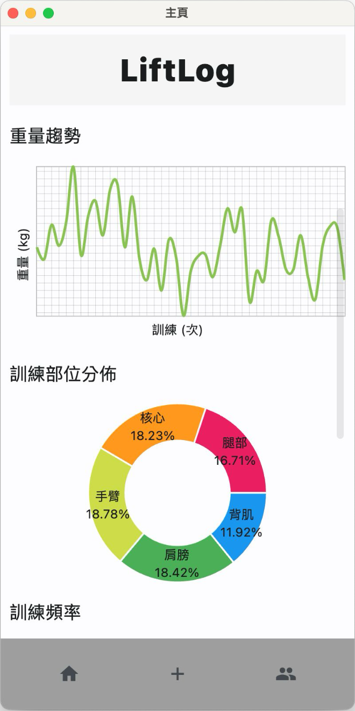
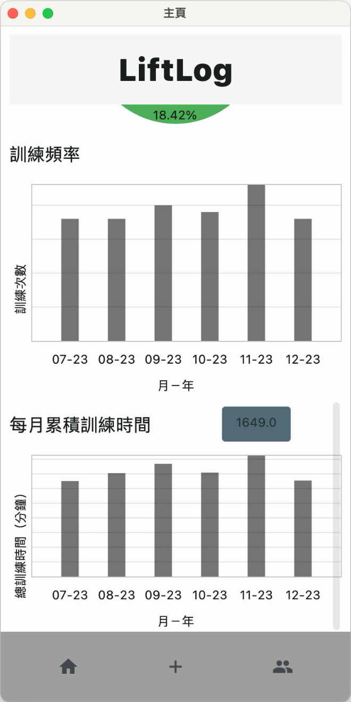

# LiftLog -- 健身紀錄 app

這個 app 提供重量訓練者一個操作簡單的介面，讓使用者可以紀錄每次的訓練內容，也能查看歷史紀錄的分析及分享自己的訓練紀錄。

## 功能

### 註冊和登錄

-   **創建帳戶**
    -   用戶提供用戶名、電子郵件和密碼

-   **登入**
    -   用戶輸入電子郵件和密碼

### 健身紀錄

-   **訓練**
    -   開始、結束日期時間
    -   包含許多訓練組
-   **訓練組（Set）**
    -   動作、重量、次數

### 重量統計

-   **最大重量紀錄**
    -   查看用戶每一個訓練動作的歷史最大重量
-   **重量趨勢**
    -   查看用戶每一個訓練動作的重量變化趨勢

### 訓練頻率統計

-   **訓練部位分佈**
    -   查看用戶訓練各部位的總組數佔比

-   **訓練次數統計**
    -   查看用戶各個月份的總訓練分鐘數
    -   查看用戶各個月份的總訓練次數

### 社交

-   **觀看其他用戶紀錄**
    -   查看其他用戶最近的訓練內容

-   查看每一個動作的最大重量紀錄以及創下該紀錄的用戶

## 開發框架 Tech Stack

-   使用者介面: **Flet**
-   後端: **Python**
-   資料庫: **MySQL**

## 資料庫架構

## [Demo Video](demo_video.mp4)
